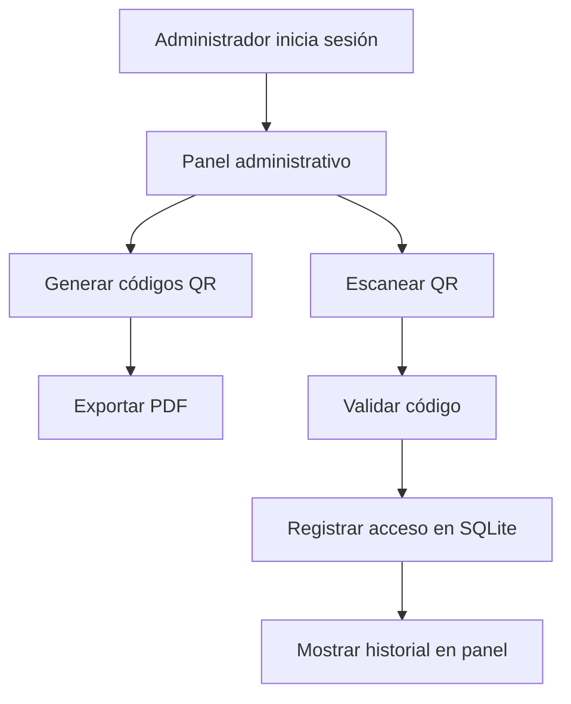

<div align="center">

# 🚀 Sistema MVP QR — Control de Accesos

### Plataforma web para generar, escanear y administrar accesos mediante códigos QR.

<p>
  
  
  
  
</p>

<p>
  <b>MVP funcional</b> · Login administrativo · Generación de QR · Escáner web · Historial de accesos
</p>

</div>

---

## 📌 Descripción

Este proyecto es un **sistema MVP de control de accesos basado en códigos QR**.  
Permite a un administrador iniciar sesión, generar códigos QR por local o establecimiento, escanearlos desde una interfaz web y consultar el historial de accesos registrados.

La idea principal es tener una solución sencilla, rápida y funcional para validar entradas, visitas o accesos sin depender de hardware especializado.

---

## ✨ Funcionalidades principales

| Módulo | Descripción |
|---|---|
| 🔐 Login administrativo | Acceso protegido para un administrador único. |
| 📦 Generación de QR | Creación de códigos QR asociados a locales o accesos. |
| 📄 Exportación PDF | Generación de archivos PDF listos para imprimir. |
| 📷 Escáner QR | Lectura de códigos QR desde cámara web. |
| 📊 Panel admin | Visualización de registros e historial. |
| ⏱️ Actualización dinámica | Consulta periódica del historial desde el panel. |

---

## 🧱 Stack actual

| Área | Tecnología | Uso dentro del proyecto |
|---|---|---|
| Backend | Python | Lenguaje principal del servidor. |
| Framework | Flask | Rutas, vistas, lógica backend y control de sesiones. |
| Base de datos | SQLite | Almacenamiento local de registros y datos del sistema. |
| Frontend | HTML, CSS, JavaScript | Interfaz del panel, login y escáner. |
| QR | qrcode | Generación de códigos QR. |
| PDF | ReportLab | Exportación de códigos QR en PDF. |
| Cámara / Scanner | JavaScript | Lectura del QR desde el navegador. |

---

## 🧭 Flujo general del sistema



---

## 📂 Estructura recomendada

```bash
project-qr/
│
├── app.py
├── requirements.txt
├── database.db
│
├── static/
│   ├── css/
│   │   └── styles.css
│   ├── js/
│   │   └── scanner.js
│   └── qr/
│
├── templates/
│   ├── login.html
│   ├── admin.html
│   └── scanner.html
│
└── README.md
```

---

## ⚙️ Instalación

### 1. Clonar el repositorio

```bash
git clone https://github.com/tu-usuario/tu-repositorio.git
cd tu-repositorio
```

### 2. Crear entorno virtual

```bash
python -m venv venv
```

### 3. Activar entorno virtual

**Windows:**

```bash
venv\Scripts\activate
```

**Linux / macOS:**

```bash
source venv/bin/activate
```

### 4. Instalar dependencias

```bash
pip install -r requirements.txt
```

### 5. Ejecutar el proyecto

```bash
python app.py
```

Después abre en el navegador:

```bash
http://127.0.0.1:5000
```

---

## 🔑 Credenciales de prueba

> ⚠️ Estas credenciales son únicamente para demostración. No deben usarse en producción.

```txt
Usuario: admin
Contraseña: admin123
```

---

## 🌐 Rutas principales

| Ruta | Descripción |
|---|---|
| `/login` | Inicio de sesión del administrador. |
| `/admin` | Panel principal de administración. |
| `/scanner` | Vista para escanear códigos QR. |
| `/generate_qr` | Generación de códigos QR. |
| `/history` | Consulta del historial de accesos. |
| `/logout` | Cierre de sesión. |

---

## 🔒 Seguridad actual

Actualmente el sistema funciona como **MVP**, por lo que la seguridad es básica.

Incluye:

- Login de administrador.
- Protección de rutas privadas.
- Validación básica del acceso.
- Registro de escaneos.

Pero ojo, bro: para producción todavía le falta ponerse mamalón. No subas esto tal cual a internet pensando que ya es sistema bancario, porque no. 💀

---

## 🚀 Futuro stack recomendado

Cuando el proyecto crezca, este sería un stack mucho más sólido:

| Área | Tecnología recomendada | Motivo |
|---|---|---|
| Backend | FastAPI o Flask Blueprints | Mejor organización y escalabilidad. |
| Base de datos | PostgreSQL | Más robusta para producción que SQLite. |
| ORM | SQLAlchemy | Manejo más limpio de modelos y consultas. |
| Autenticación | JWT + refresh tokens | Sesiones más seguras y controladas. |
| Frontend | React + TypeScript | Interfaz más dinámica y mantenible. |
| UI | Tailwind CSS | Diseño rápido, limpio y responsive. |
| Hosting backend | Render, Railway o VPS | Despliegue estable del servidor. |
| Base de datos cloud | Supabase, Neon o Railway DB | PostgreSQL administrado. |
| Logs | Loguru o logging avanzado | Mejor monitoreo de errores. |
| Seguridad | Variables de entorno + bcrypt | Credenciales protegidas y contraseñas hasheadas. |
| Contenedores | Docker | Entorno reproducible para desarrollo y producción. |

---

## 🗺️ Roadmap

### Versión MVP

- [x] Login administrativo.
- [x] Generación de códigos QR.
- [x] Escáner QR desde navegador.
- [x] Registro en base de datos.
- [x] Exportación PDF.

### Próximas mejoras

- [ ] Usar variables de entorno para credenciales.
- [ ] Hashear contraseñas con bcrypt.
- [ ] Migrar SQLite a PostgreSQL.
- [ ] Separar rutas por módulos o Blueprints.
- [ ] Crear dashboard con estadísticas.
- [ ] Agregar roles de usuario.
- [ ] Mejorar diseño responsive.
- [ ] Agregar Docker.
- [ ] Desplegar versión pública.

---

## 🧪 Dependencias principales

```txt
flask
qrcode[pil]
reportlab
```

---

## 📸 Capturas sugeridas

Cuando tengas imágenes del sistema, agrégalas aquí:

```md


```

---

## 🧠 Nota técnica

Este proyecto está pensado como una primera versión funcional. Su mayor valor está en validar la lógica del negocio: generar accesos, leerlos y guardar registros.

La siguiente etapa importante no es meterle mil cosas a lo pendejo, sino **ordenar arquitectura, seguridad y base de datos**.

---

## 👨‍💻 Autor

Desarrollado por **Jeshua Garza**.

Proyecto creado como solución MVP para control de accesos mediante códigos QR.

---

<div align="center">

### ⭐ Si este proyecto te sirve, considera dejar una estrella al repositorio.

</div>
